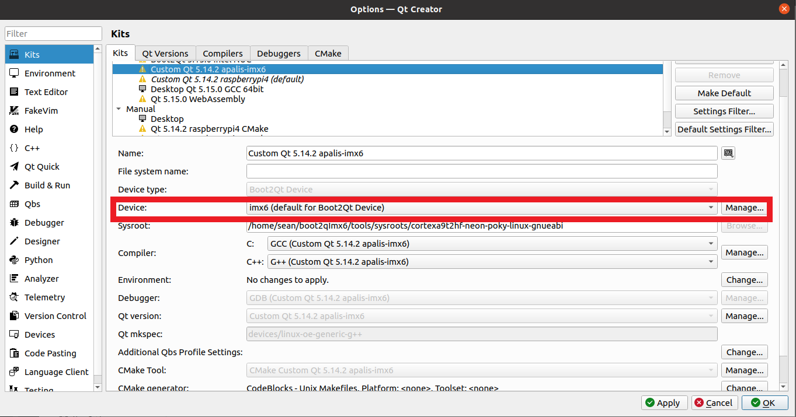

# Introduction
The purpose of this repository is to provide instructions on how to...
1. Use yocto to build a linux kernel to support Qt applications.
2. Compile and deploy tools necessary for cross platform development.
3. Install the tools and have them integrate with Qt Creator.

The following instructions have been slightly modified from the Qt website.
https://doc.qt.io/QtForDeviceCreation/qtee-custom-embedded-linux-image.html

Notes:
There is a bug with vs code that will consume all of your CPU and memory when opening workspaces with a large amount of files.
See:
- https://github.com/microsoft/vscode/issues/3998
- https://github.com/Microsoft/vscode/issues/61393

Don't open this directory within VSCode after your linux kernel has been built or until these issues have been closed.

# Prerequisites
- Install docker for your system. Instructions can be found here: https://duckduckgo.com/?q=docker+linux+install&t=canonical&atb=v216-1.

    We use docker to ensure that the tools used to compile our linux kernel remain the same between builds.

- Developers must have 


# Steps to create an image and cross platform tools
1. Clone this repository to your work machine.
2. In the `Dockerfile`, modify the `machine` variable to match the device you would like to target. A list of valid values for the machine variable is as follows.

    |                Board                 |  MACHINE value  |
    | :----------------------------------: | :-------------: |
    |    Boundary Devices i.MX6 Boards     |   nitrogen6x    |
    |      Boundary Devices Nitrogen7      |    nitrogen7    |
    |              Intel NUC               | intel-corei7-64 |
    |         Kontron SMARC-sAMX6i         |  smarc-samx6i   |
    |          NVIDIA Jetson TX1           |   jetson-tx1    |
    |          NVIDIA Jetson TX2           |   jetson-tx2    |
    |           NXP i.MX7D SABRE           |  imx7dsabresd   |
    |        NXP SABRE SD i.MX6Dual        |  imx6dlsabresd  |
    |        NXP SABRE SD i.MX6Quad        |  imx6qsabresd   |
    |             Raspberry Pi             |   raspberrypi   |
    |            Raspberry Pi 2            |  raspberrypi2   |
    |            Raspberry Pi 3            |  raspberrypi3   |
    |            Raspberry Pi 4            |  raspberrypi4   |
    |          Raspberry Pi Zero           |  raspberrypi0   |
    | Renesas R-Car H3 Starter Kit Premier |     h3ulcb      |
    |   Renesas R-Car M3 Starter Kit Pro   |     m3ulcb      |
    |          Renesas Salvator-X          |   salvator-x    |
    |         Toradex Apalis iMX6          |   apalis-imx6   |
    |         Toradex Apalis iMX8          |   apalis-imx8   |
    |         Toradex Colibri iMX6         |  colibri-imx6   |
    |         Toradex Colibri iMX7         |  colibri-imx7   |
    |                WaRP7                 |   imx7s-warp    |

3. Build the image using the following commands.
   ```bash
   cd <Directory containing dockerfile>
   docker build -t qt_device_creation:1.0 .
   ```
4. Run the following command to start a container.
    ```bash
    docker run \
        --rm \
        --interactive \
        --tty \
        --volume `pwd`:/workspaces/qt_device_creation \
        qt_device_creation:1.0 \
        --workdir=/workspaces/qt_device_creation
    ```
5. Inside the docker container, fetch the Qt starting recipes for the various hardware platforms. 
    ```bash
    repo init -u git://code.qt.io/yocto/boot2qt-manifest -m v5.15.0.xml
    repo sync
    ```
6. Inside the docker container, initialize the environment to be able to use the bitbake tool.

    ```bash
    source ./setup-environment.sh
    ```
    You should see the following output

    ```txt
    ### Shell environment set up for builds. ###

    You can now run 'bitbake <target>'

    Common targets are:
        b2qt-embedded-qt5-image
        meta-toolchain-b2qt-embedded-qt5-sdk

    QBSP target is:
        meta-b2qt-embedded-qbsp

    For creating toolchain or QBSP for Windows, set environment variable before running bitbake:
        SDKMACHINE=i686-mingw32

    For more information about Boot to Qt, see https://doc.qt.io/QtForDeviceCreation/
    ```
 
7. Run the bitbake command to build the embedded linux image.
    ```bash
    bitbake b2qt-embedded-qt5-image
    ```
    Note: If the image is built from scratch, it may take several hours to complete the compile process.

8. In addition to creating the image, you also want to create the tools for cross platform development by running the following command.

    ```bash
    bitbake meta-toolchain-b2qt-embedded-qt5-sdk
    ```

9.  Once the build is finished, exit the docker container by running the following command.
    ```bash
    exit
    ```

10. You need to flash the device you wish to deploy Qt applications to. Flashing instructions can vary between devices so consult the flashing instructions for your piece of hardware. You can find the image to be flashed at  `<docker file directory>/build-<your machine>/tmp/deploy/images/<your machine>`.

    Note: It may be worth adding the mender.io layer for over the air updates to the custom embedded linux image.

11. You should find the `<docker file directory>/build-<your machine>/tmp/sdk/b2qt-x86_64-meta-toolchain-b2qt-embedded-qt5-sdk-<your machine>.sh` file. This is a self contained script that will install any dependencies for cross platform development. Move this file to the repo where developers are going to be working on the GUI application.

# Installation Instructions
These instructions are are to be followed by all developers working on the GUI application on their linux development environment. They are intended to get developers to be able to use the cross platform tools that were created and push changes to the development machine.

1. Run the `b2qt-x86_64-meta-toolchain-b2qt-embedded-qt5-sdk-<your machine>.sh` script. Note, the script will ask you to specify a directory where to install the cross platform tools. It is suggested to create a tools directory contained within the repo where the GUI application will be developed and add the tools directory to the `.gitignore`. This way you don't forget to uninstall the tools once you are done with the project.

2. Create a Qt kit by navigating to where the cross platform tools were installed and run the following script. 
    ```bash
    sudo ./configure-qtcreator.sh --qtcreator <your qt creator path>
    ```
    A kit to cross compile the device should now appear within Qt creater.

3. Refer to the following instructions to add the device within Qt creator so you can copy files and ssh into the target device.

    https://doc-snapshots.qt.io/qtcreator-4.0/creator-developing-generic-linux.html

4. Add the device to the kit. Go to `Tools -> Kits` and make sure the `Device` field is populated with the target.

    

5. You should now be able to deploy applications to the target device by simply selecting the kit and hitting the run button. 

# Known Issues/Needed Tweaks
1. In order to deploy the application, no other Qt processes should be running. You may need to remote into the machine an kill any running Qt processes.
2. You are able to ssh into the device as root without being prompted for a password or having keys set. This should be changed within the yocto recipes.


# Additional Resources

All Qt does is add its own yocto meta layers. To understand yocto more, feel free to refer to the following documentation.
- https://www.yoctoproject.org/

To fetch and manage all of the git repos to build the kernel, it is suggested you use the `repo` tool (`repo` is installed in the docker file). 
- https://github.com/gumstix/yocto-manifest
- https://gerrit.googlesource.com/git-repo/+/refs/heads/master/README.md

